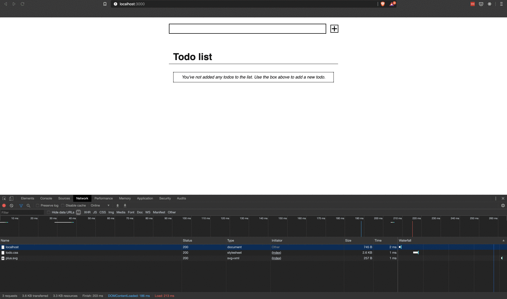

# Basic To-do App

Based on [this post](https://dev.to/deciduously/skip-the-framework-build-a-simple-rust-api-with-hyper-4jf5) on [dev.to](https://dev.to). The goal is to create a To-do app using no frameworks, just "simple" libraries.

# Demo

